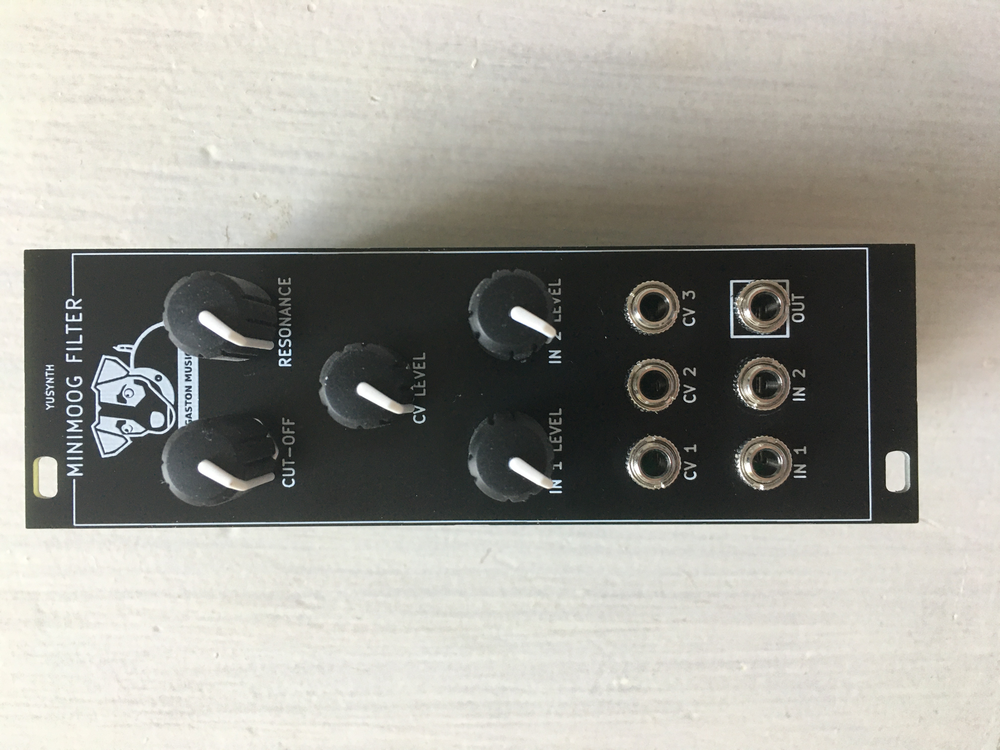
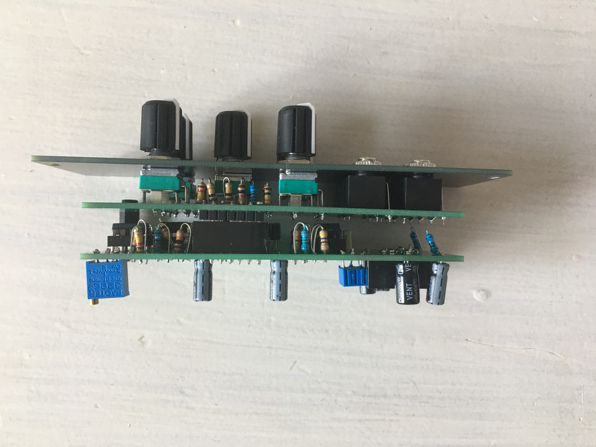

# Yusynth-MiniMoog-Filter
Adaptation du Yusynth [MiniMoog Filter](http://yusynth.net/Modular/index_en.html) au format Eurorack

testé et fonctionnel

[Build document](https://htmlpreview.github.io/?https://github.com/jojo-monk/Yusynth-MiniMoog-Filter/blob/main/ibom.html)

